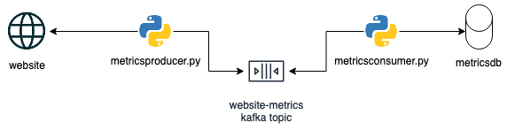

# Problem Statement

Refer [pdf](docs/Engineering_Manager_-_Berlin.pdf) for the details.

# Website Metrics Pipeline



# Most Common Command

```
# Clone the repo
git clone https://github.com/rockoder/website-metrics-pipeline.git

# Create virtual env for running the demo
python -m venv demo

# Install the dependencies
pip install -r requirements.txt

# Run the producer. Remove '&' at the end if you don't want to run in background
python metricsproducer/metricsproducer.py --env test &

# Run the consumer. Remove '&' at the end if you don't want to run in background
python metricsconsumer/metricsconsumer.py --env test &

```

Logs will be generated in `logs` directory. To run the production, pass `prod` as `--env`

# Dev Setup

If you prefer PyCharm, all the project and run configuration files are committed to the .idea directory.

# Notes, Assumptions and TODOs

1. Secrets has been committed to the repo for simplicity. Ideally these should not be here and should be managed through proper secrets manager.
1. In general more work can be done of deployment pipeline. Ex: We assume the postgresql client library is already present on the system which is required by psycopg2. This step can be better automated by using containers.
